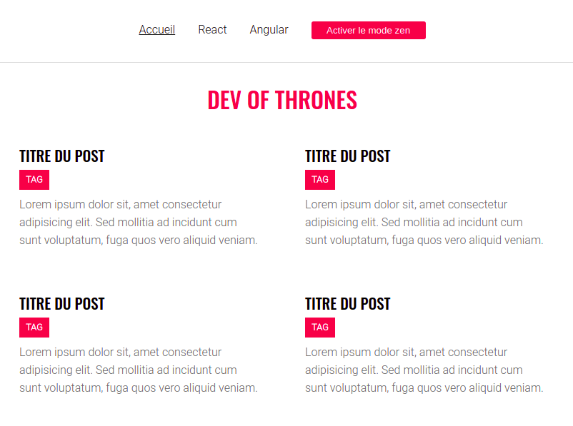

# Blog React

Little React blog

## Notions :

Hooks

- useState()
- useParams()

React router

- `<BrowserRouter></BrowserRouter>`
- `<Routes></Routes>`
- `<Route path={} element={(...JSX...)} />`
- `<Link to={...url...}></Link>`
- `<NavLink to={...url...} className={(props) => (...function...)}></NavLink>`

Higher order component  
  
Pure function  
Axios  

  
Mode zen : Off

  
Mode zen : On

